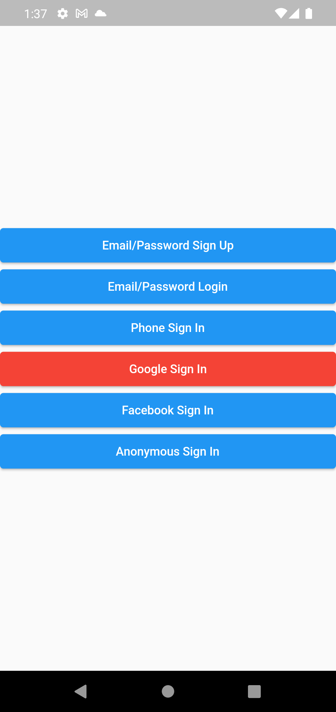
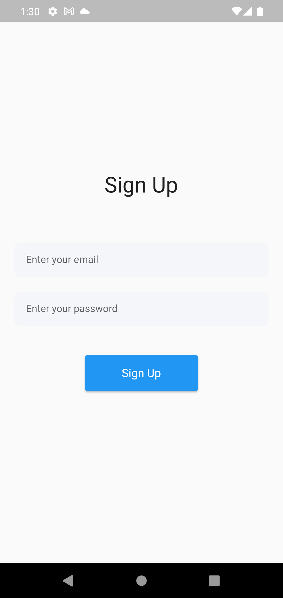
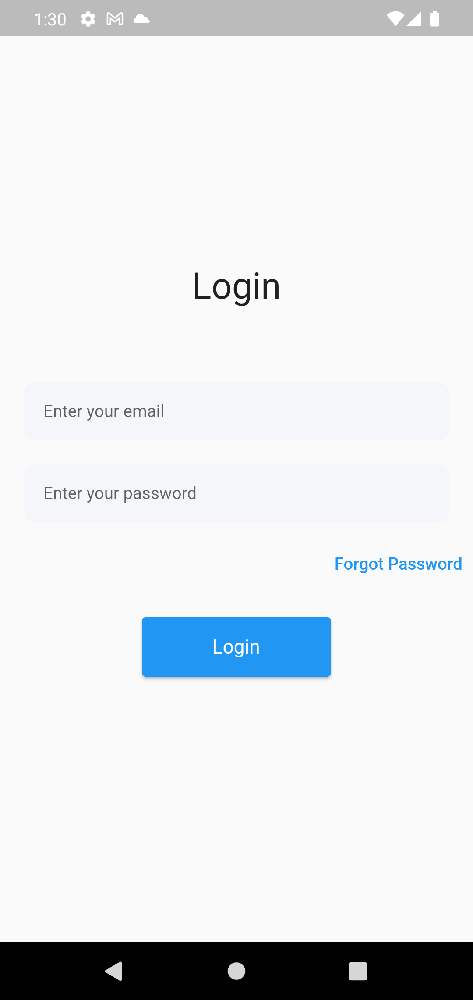
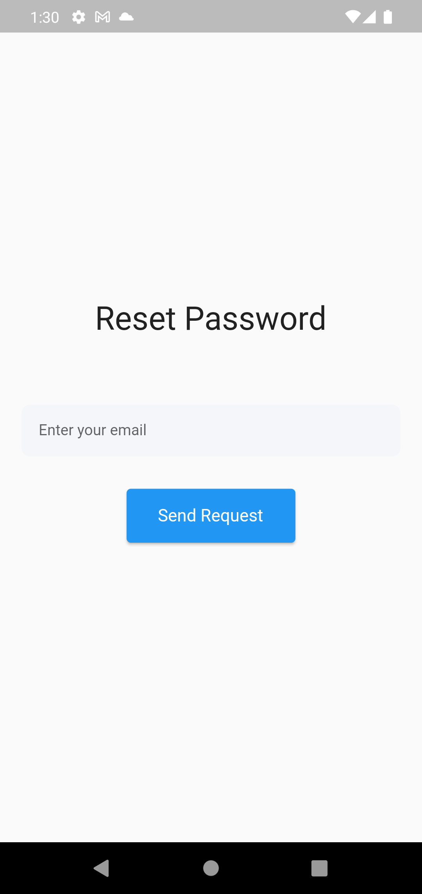
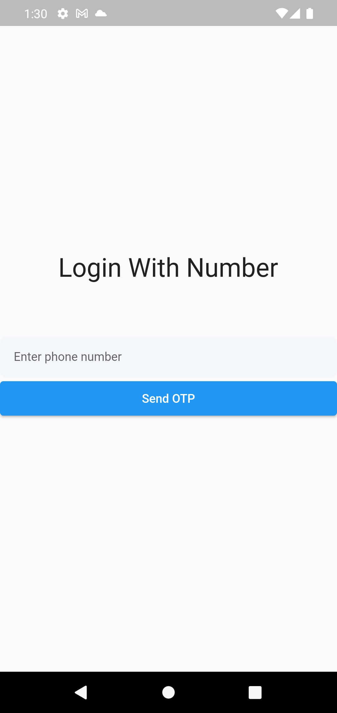
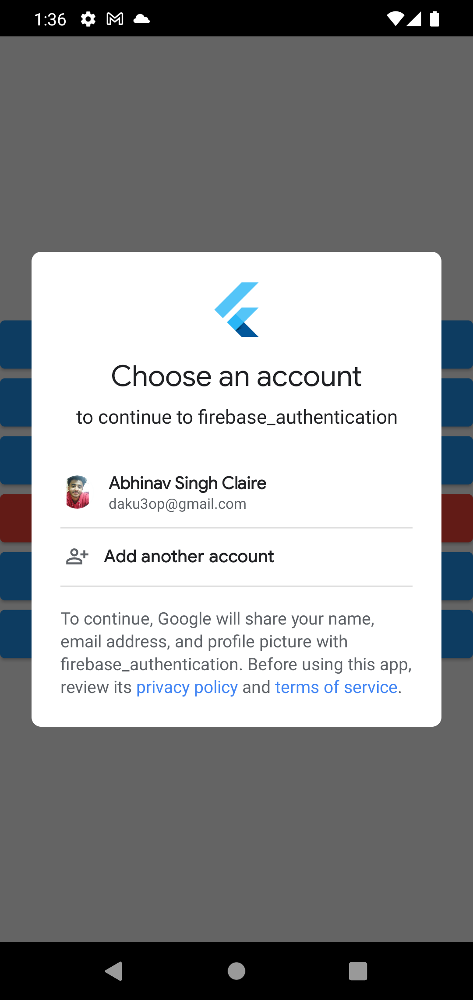

# Firebase Authentication App

I created this app to learn about Firebase and its implementation in flutter apps.  
With the help of firebase we can easily implement different ways of Authentication

## Show some :heart: and star the repo to support the project.

## Note
This repository is still under development and I will continue to add more features to it.

## Features

 * Sign In Methods
   * Email/Password Sign Up and Login
   * Phone Sign In
   * Google Sign In
   * Facebook Sign In
   * Anonymous Sign In 
   
 * Extra Features
   * Sign Out 
   * Delete Account 
   * Verify Email
   * Shows Sign In Details After Sign In
 
 
 
## Screenshots

Screen 1               |  Screen 2                          |  Screen 3       |  Screen 4
:-------------------------:|:-------------------------:|:-------------------------:|:-------------------------:
|||

Screen 5                   |              Screen 6               |  Screen 7     |  Screen 8  
:-------------------------:|:-------------------------:|:-------------------------:|:-------------------------:
|||

